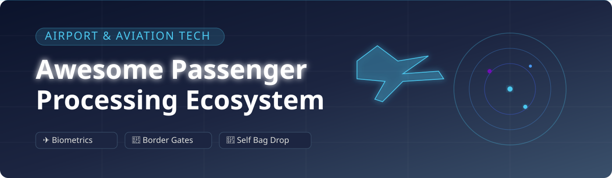

# ✈️ Awesome Passenger Processing Systems & Airport Biometrics 🛂

  

  
  
  
  
  

> 🌟 A curated list of **SaaS products**, enterprise airport processing systems, and **open-source identity verification frameworks** powering touchless travel, airport biometrics 🧬, self-service check-in 🎟️, bag drop 🧳, border control e-gates 🛂, and seamless passenger journeys 🛫.

---

## 📑 Table of Contents

- [📊 Overview & Market Insights](#-overview--market-insights)
- [🏢 SaaS & Enterprise Platforms](#-saas--enterprise-platforms)
- [💻 Open-Source GitHub Projects](#-open-source-github-projects)
- [🛠️ Architecture & Implementation PoCs](#️-architecture--implementation-pocs)
- [🤝 How to Contribute](#-how-to-contribute)
- [📈 Star History](#-star-history)
- [⚠️ Disclaimer](#️-disclaimer)

---

## 📊 Overview & Market Insights

The global **Airport Passenger Processing & Smart Operations** market is estimated at **USD 7.5 – 7.9 Billion (2026)** and is projected to expand significantly to over **USD 45 Billion by 2035** (growing at a CAGR of ~22%), driven by rising passenger volumes 🌐, workforce constraints, and rapid adoption of digital biometrics 🧬.

### 🌐 Sector Fragmentation & Market Structure
- 🧩 **Moderately Fragmented:** The industry is governed by a blend of large aerospace systems integrators, specialised biometric vendors, and cloud airport operational platform providers.
- 🛡️ **High Barriers to Entry:** Because passenger processing systems integrate deeply with Departure Control Systems (DCS), government identity databases (e.g., U.S. CBP TVS, India DigiYatra), ICAO border standards, and hardware gates, the sector is **not a simple 'winner-take-all' SaaS market**. Instead, market leaders compete via strategic partnerships, long-term airport concessions, and enterprise acquisitions.

---

## 🏢 SaaS & Enterprise Platforms

Below is a comparative breakdown of top commercial passenger processing platforms, ordered by **Company Scale / Annual Revenue (Descending)** 📉.

| Product 📦 | Company Size / Valuation 💰 | Description 📝 | Pricing 🏷️ | Free Tier Limits 🎁 |
| :--- | :--- | :--- | :--- | :--- |
| **[Collins Aerospace (ARINC)](https://www.collinsaerospace.com/)** | **~$30.2 Billion** *(Annual Revenue)* | Airport and airline passenger processing systems, including common-use platforms (CUPPS/CUSS) and terminal operational technology. | Enterprise quote-based (custom procurement per airport deployment) | No public free tier; technical walkthrough & demo available upon request |
| **[Amadeus Self-Service / Seamless solutions](https://amadeus.com/)** | **~$28.0 Billion** *(Market Cap / €6.5B Rev)* | Comprehensive passenger service and biometric gate solutions supporting self-service check-in, bag drop, and contactless identification flows. | Enterprise quote-based (custom annual/per-passenger licensing via sales inquiry) | No public free tier; proof-of-concept/demo environment available upon sales consultation |
| **[Idemia Travel](https://www.idemia.com/)** | **~$3.0 Billion** *(€2.4B–€2.8B Annual Rev)* | Biometric and identity solutions for airports and borders, including facial recognition algorithms and automated border control (ABC) gates. | Enterprise quote-based (custom agreement tailored to government/airport requirements) | No public free tier; demo/pilot evaluation upon enterprise consultation |
| **[SITA Smart Path](https://www.sita.aero/)** | **~$1.71 Billion** *(Annual Revenue)* | Leading biometric passenger processing platform enabling seamless, token-based journeys from check-in through boarding and border control. | Enterprise quote-based (contact sales; custom contract per airport/airline setup) | No public free tier; interactive live demonstration available upon sales request |
| **[Vision-Box](https://www.vision-box.com/)** | **~$350 Million** *(Acquired by Amadeus; €70M Rev)* | Biometric identity and seamless travel solutions widely deployed for border control, e-gates, and passenger flow management. | Enterprise quote-based (custom deployment contract based on hardware/touchpoints) | No public free tier; targeted project pilot/demonstration available on request |
| **[ICTS Europe](https://www.icts.eu/)** | **~$300 Million+** *(Estimated Group Revenue)* | Security and passenger processing services, travel document verification systems, and technology for aviation environments. | Enterprise quote-based (custom service & platform agreement) | No public free tier; initial security audit & demo upon consultation |
| **[Daon IdentityX](https://www.daon.com/)** | **~$100 Million+** *(Estimated Enterprise Rev)* | Multi-modal biometric identity platform used in travel, banking, and high-security identity verification scenarios. | Enterprise quote-based (custom pricing based on authentication volume/modules) | No public free tier; scheduled 30-min live demo available upon request |
| **[Materna IPS](https://www.materna-ips.com/)** | **~$50 Million** *(Acquired by SITA)* | Passenger processing and self-service hardware/software solutions for check-in, self bag drop, and airport operations. | Enterprise quote-based (custom quote based on kiosk units & software modules) | No public free tier; personalized live product demo available upon request |
| **[AeroCloud](https://www.aerocloud.com/)** | **~$16 Million** *(Total Venture Funding)* | Cloud-native airport operations and passenger experience platform with digital passenger processing and queue management. | Enterprise quote-based (modular subscription based on active airport features; no user seat fees) | No public free tier; 30-minute interactive live platform demo available upon request |
| **[Airware](https://www.airware.com/)** | **Commercial Enterprise** *(Niche Provider)* | Passenger and airport technology solutions supporting regional airline processing and operational workflows. | Enterprise quote-based (custom licensing per site/workstation) | No public free tier; consultation & tailored demo available upon request |

---

## 💻 Open-Source GitHub Projects

Production-grade biometric border control and passenger departure control systems (DCS) require ICAO/IATA certification and regulatory approval 📜. However, open-source building blocks allow developers to build proof-of-concept passenger check-in, document OCR, facial verification, and flow analysis systems 🚀.

The repositories below are sorted by **GitHub Star Count (Descending)** ⭐.

| Project / Repository 🛠️ | Star Count ⭐ | Category / Description 📝 | Primary Tech Stack ⚙️ |
| :--- | :--- | :--- | :--- |
| **[ageitgey/face_recognition](https://github.com/ageitgey/face_recognition)** |  | World's simplest facial recognition API for Python & CLI. Powers experimental check-in and facial identification PoCs. | Python, dlib, C++ |
| **[deepinsight/insightface](https://github.com/deepinsight/insightface)** |  | State-of-the-art 2D/3D deep face analysis and facial recognition toolkit suitable for high-accuracy biometric gates. | Python, PyTorch, ONNX |
| **[serengil/deepface](https://github.com/serengil/deepface)** |  | Lightweight facial recognition and facial attribute analysis framework (VGG-Face, Facenet, ArcFace) for identity verification. | Python, TensorFlow, Keras |
| **[biometrics/openbr](https://github.com/biometrics/openbr)** |  | Open source biometric recognition framework for facial recognition, age estimation, and gender classification in identity flows. | C++, OpenCV, Qt |
| **[konstantint/PassportEye](https://github.com/konstantint/PassportEye)** |  | Python tool for reading and parsing Machine Readable Zones (MRZ) from passport images and travel documents. | Python, OpenCV, Tesseract OCR |
| **[openbm/openbiometrics](https://github.com/openbm/openbiometrics)** |  | Open biometric platform offering facial recognition algorithms, liveness detection, and identity verification utilities. | C++, Python |
| **[DocsaidLab/MRZScanner](https://github.com/DocsaidLab/MRZScanner)** |  | Deep learning based MRZ detection and parsing library for international travel passports and ID cards. | Python, PyTorch |
| **[SerdarHelli/MRZ_Passport_Reader_From_Image](https://github.com/SerdarHelli/MRZ_Passport_Reader_From_Image)** |  | Complete pipeline using TensorFlow Lite & EasyOCR for passport MRZ text extraction and identity parsing. | Python, TensorFlow Lite, EasyOCR |
| **[sivakumar-mahalingam/fastmrz](https://github.com/sivakumar-mahalingam/fastmrz)** |  | Fast, lightweight passport MRZ reader library optimized for mobile/kiosk passenger check-in applications. | Python, OpenCV |

---

## 🛠️ Architecture & Implementation PoCs

If you are prototyping an open passenger processing or biometric travel system, consider the following pipeline 🏗️:

1. 🛂 **Document & Passport Scan:** Extract passenger PNR and ICAO 9303 MRZ data via [PassportEye](https://github.com/konstantint/PassportEye) or [MRZScanner](https://github.com/DocsaidLab/MRZScanner).
2. 📸 **Biometric Enrolment:** Capture live face image at self-service kiosk / mobile app using [InsightFace](https://github.com/deepinsight/insightface) or [DeepFace](https://github.com/serengil/deepface).
3. 👁️ **Liveness Detection & Anti-Spoofing:** Verify real-time presence to prevent photo presentation attacks.
4. 🎟️ **Identity Token Creation:** Map biometric vector to flight booking / boarding pass token.
5. 🛫 **Seamless Gate Matching:** Match passenger face at security/boarding e-gate against stored identity token.

> ⚠️ **Note:** Production airport deployments require strict adherence to international security standards (ICAO 9303, IATA One ID, GDPR/Privacy regulations) and hardware integration with certified CUSS/CUPPS kiosks and ABC gates.

---

## 🤝 How to Contribute

1. 🍴 **Fork** the repository.
2. ✏️ Add or update entries in `README.md` keeping the formatting consistent.
3. 🏷️ Ensure **SaaS products** are added with company scale estimates and pricing info, and **Open-Source tools** include their GitHub Stars_Badges.
4. 📩 Submit a **Pull Request** with a brief explanation.

---

## 📈 Star History

---

## ⚠️ Disclaimer

This repository is community-curated for informational and educational purposes. Passenger processing and biometric border systems are strictly regulated under international aviation security laws. Open-source components listed here are intended for research, education, and prototyping only, and are not certified for live operational use in airports without proper compliance and vendor integration.

---

**Maintained for aviation software engineers ✈️, airport innovation labs 🧪, and identity tech researchers 🧬.**
